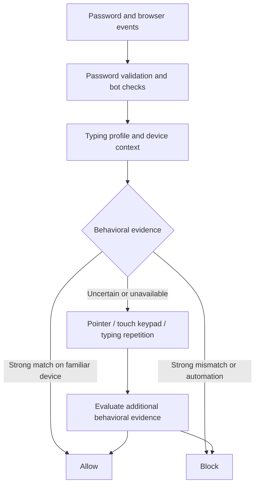

# BioPrint

**A correct password should not be enough for the wrong person.**

BioPrint is a browser-based behavioral login system built for ROOT 36. It learns
how an account holder types and moves the pointer, checks browser/device context,
and detects automation as a separate signal. The final application on **`main`**
uses typing first, with trained pointer verification when additional behavioral
evidence is needed. Touch devices use the keypad path. There are no OTPs or
external authenticator services.

[Six-page report](reports/2026-09-20/bioprint-report-draft/bioprint-report.pdf) ·
[Dataset results](reports/2026-09-20/DATASET_RESULTS.md) ·
[Experiment setup](docs/DATASETS.md) ·
[Model assets](models/README.md)

## Quick start — Linux

Supported setup: **Linux x86_64, Python 3.12**, a current Chrome/Chromium or Firefox
browser, and a physical keyboard with a mouse or touchpad for initial enrollment.
CPU inference is sufficient; no GPU, Node.js build, research dataset or cloud
account is required. Internet access is needed to install dependencies.

**Use a dedicated Conda environment** to avoid conflicts with system packages:

```bash
git clone https://github.com/AnanthaKrishnan63/BioPrint.git
cd BioPrint
conda env create -f environment.yml
conda activate bigidea
python launch.py
```

Open **http://localhost:8000**. Stop with **Ctrl-C**.
The launcher binds only to `127.0.0.1:8000`; it does not serve on the local network.
It checks dependencies and model checksums before starting. The app works offline
after installation. If you already have an environment named `bigidea`, create a
separate one with `conda env create -n bioprint -f environment.yml` and activate
`bioprint` instead.

Already have an isolated Python 3.12 environment? Install with
`python -m pip install -r requirements.txt`. The file pins the runtime and its
transitive dependencies, including the CPU-only PyTorch build.

```bash
python launch.py --check             # check installation without starting a server
python launch.py --data-dir /path/to/local/bioprint-data
```

## Try the final app

1. **Register with a demo-only password.** Follow the typing enrollment: one warmup
   and ten accepted repetitions, then six target/keypad runs. Type naturally;
   corrections or incorrect passwords may require another sample.
2. **Sign in as the owner.** Familiar device context and a strong typing match can
   permit direct login. Uncertain evidence requests additional behavioral input.
3. **Enroll the trained pointer profile.** After signing in, follow the pointer
   enrollment prompt and complete three one-minute movement recordings. Each
   account receives its own profile. Until this is complete, its pointer challenge
   uses the statistical motor scorer.
4. **Try a different person with the same credentials.** Compare the decision and
   explanation with the owner's attempt. Outcomes depend on the collected profile;
   a biometric system does not guarantee that every impostor is rejected.
5. **Inspect the dashboard** at `/dashboard.html` for signal scores and decisions.
   Keep the demo on localhost: this is a research dashboard, not a hardened admin
   service.

**Use test credentials you do not use anywhere else.** Although credentials are
hashed for password checking, this prototype also retains password-field physical
key codes and timing events. Those recordings can reveal a typed password.
Local account data is stored in ignored `runtime/bioprint.db`; the session signing
key is in `runtime/session.key`. Neither is shipped or uploaded. Preserve both
when backing up your local demo. Existing databases are not replaced on launch.

## How authentication works



- **Typing:** hold times and key-to-key intervals are compared with enrollment.
  Arbitrary supported passwords use a statistical distance profile. A compatible
  `.tie5Roanl` feature schema with enough enrollment activates a per-user radial
  basis function support vector machine (RBF SVM), fitted against the included
  public-data background bank and separately calibrated negatives. This is not a
  universal pretrained model for every password.
- **Pointer:** a frozen fully convolutional network converts movement sequences
  into embeddings; cosine similarity compares a probe with the user's enrolled
  profile. Its weights are included in Git and verified at startup.
- **Device context:** fuzzy comparisons of hardware, browser and network attributes
  inform whether a device is familiar. Device changes are contextual evidence,
  not proof that someone is an impostor.
- **Automation:** environment, timing and replay heuristics remain separate from
  identity matching. Client-reported browser signals are not tamper-proof.
- **Behavioral step-up:** the app obtains more typing, pointer or touch behavior
  before a final decision; it does not fall back to possession factors.

## Results and why this combination

False acceptance rate (FAR) measures accepted impostor attempts; false rejection
rate (FRR) measures rejected genuine attempts. Equal error rate (EER) describes a
score threshold where the two rates meet; it is not available as one meaningful
number for this branching application policy.

| Paired synthetic policy evaluation | FAR | FRR |
|---|---:|---:|
| Typing + statistical pointer | 15.56% (14/90) | 21.67% (13/60) |
| Typing + trained pointer | **10.00% (9/90)** | 31.67% (19/60) |

The trained pointer combination reflects our priority of reducing false accepts,
with a measured rejection tradeoff. These are **synthetic scenario results**, not
accuracy estimates for real deployment. The small paired evaluation does not
establish overall statistical superiority. These aggregates precede the latest
mobile bot-rule and threshold changes. The report explains source-dataset results,
training/calibration separation, failed experiments and limitations; its companion
[156-row ledger](reports/2026-09-20/bioprint-report-draft/complete-results.csv)
retains the detailed variants.

## Automated model demonstration

```bash
python -m pip install -r requirements-dev.txt
bash experiments/typing_demo/run.sh
```

The first run downloads the public CMU dataset and reconstructs the frozen
synthetic cohort; subsequent runs reuse it. A temporary database is populated
through the actual API, compatible typing models are fitted, and five outcomes
are verified before a local HTML report opens. Use `--no-open` for headless use.

The demonstration shows true accept, true reject, false reject and false accept
at the typing-classifier threshold, plus an owner-like replay scenario. A typing
false accept need not become a final login false accept: the stricter direct-login
policy can request a challenge. These deliberately selected illustrations are not
an accuracy benchmark. No live accounts or listening server are used.

The original scripted/browser attack demonstrations are in `code/bioprint/attacks/`;
run their `--help` and use only your local test account.

## Research, tests and repository layout

| Path | Contents |
|---|---|
| `launch.py`, `environment.yml`, `requirements*.txt` | Local app startup and pinned Linux setup |
| `code/bioprint/` | Final FastAPI/SQLite application, browser interface and tests |
| `models/` | Required pointer weights, typing calibration bank and checksums |
| `experiments/` | Combination evaluation, demonstrations and recorded results |
| `scripts/`, `research/` | Research implementations, protocols and notes |
| `reports/` | Six-page LaTeX/PDF report and supporting evidence |
| `code/typing/` | Earlier capture/timing-validation harness |

Other experiment branches are preserved. A normal clone starts on `main`; you do
not need to check out any other branch to use the final app. Historical branch
launchers may reference the original research workspace. See
[dataset and reproduction instructions](docs/DATASETS.md) before rerunning them.

```bash
python -m pip install -r requirements-dev.txt
bash scripts/research.sh -m pytest code/bioprint/tests/test_experiment_policy.py \
  code/bioprint/tests/test_pointer_neural.py code/bioprint/tests/test_stepup_password_check.py
```

Full research suites additionally require their optional data/artifacts. Original
JavaScript metrics tests can be run with `cd code/typing && node --test` when Node
is installed. Node and Playwright browser binaries are not required to run the app.

## ROOT 36 submission

This repository contains the website implementation and commit history, the
[final six-page report](reports/2026-09-20/bioprint-report-draft/bioprint-report.pdf),
and the localhost setup and demo instructions above. `launch.py` is the runnable
website entry point; this submission uses a website rather than a Chrome extension.
The live demonstration is enrollment → genuine login → an impostor using the same
password or a scripted attempt → inspection of the behavioral decision.

## Troubleshooting

- **Port 8000 occupied:** stop the service already using it, then rerun the launcher.
  BioPrint will not kill another process or silently select another port.
- **Missing package or wrong Python:** activate the Conda environment and reinstall
  `requirements.txt`. Do not install into system Python.
- **Model missing/checksum mismatch:** restore `models/` from Git. No Git LFS or
  dataset download is needed for these files.
- **Old page freezes after switching versions:** hard-refresh with `Ctrl+Shift+R`.
- **Another device cannot connect:** expected; this distribution binds to loopback.
- **An experiment needs a missing dataset:** `python scripts/datasets.py NAME`
  shows where it belongs; see [the dataset guide](docs/DATASETS.md).

Third-party datasets and reference implementations retain their upstream terms
and notices. Model provenance is documented in [`models/README.md`](models/README.md).
